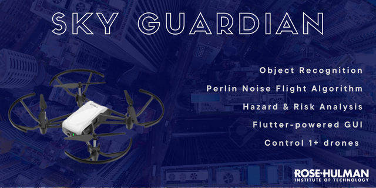

# SkyGuardian

SkyGuardian is an open-source codebase for people to learn drone control topics made by senior students at Rose-Hulman Institute of Technology located in Terre Huate, IN.

# Table of Contents

- [About](#about)
  - [Purpose](#purpose)
  - [Features](#features)
  - [System Components](#system-components)
- [Getting Started](#getting-started)
  - [Setting up drones and router](#setting-up-drones-and-router)
  - [How to run requirements](#how-to-run-requirements)
- [Examples](#examples)
  - [Implementing Reactive Behaviors](#creating-a-reactive-behavior-to-an-object)
- [Supplemental Documentation (UML, Performance Metrics, etc.)](#supplemental-documentation)
- [Troubleshooting resources](#troublehooting-resources)
- [References](#references)
- [Acknowledgements](#acknowledgements)

# About
## Purpose

## Features
SkyGuardian has the following features:
- Ability to control 1 or 2 drones through a router
- Use of Mission Pads to confine the drone to a space
- Drone flight algorithm using [Perlin Noise](https://www.khanacademy.org/computing/computer-programming/programming-natural-simulations/programming-noise/a/perlin-noise) 
- Additional safety measures using industry hardware functional safety techniques
- Pre-trained Computer Vision models to recognize objects
- Ability to implement reactive behaviors to objects
- [Flet](https://flet.dev)-powered language-agnostic GUI (Python, Go, C#)
- Easy-to-understand & User-tested documentation

## System Components

Graphic User Interface (GUI)

 
SkyGuardian uses <a href="https://flet.dev">Flet</a>, a simplified <a href="https://flutter.dev">Flutter</a> model, to build the GUI. Python is currently supported, but Go and C# are <a href="https://flet.dev/roadmap/">coming soon</a>.  

When first starting the program, the GUI brings you to a "landing" page where a user will be able to connect 1 or 2 drones.   
  
- Insert Landing/Drone Connection Page

After verifying that the drone(s) are connected, the user can continue to a Main Dashboard that displays the OpenCV window output, various sensor readings, text input for chosen object identification, and buttons to Launch, Land, Hover an inidividual drone or both drones simultaneosly.   
  
- Insert Main Dashboard pic

There is also a window for the User to adjust various settings.  
  
- Insert pic of settings window

The GUI uses the following components  

Multi-threading

 
We use threading to allow the GUI to access drone functions while the drone flight algorithm is running. This becomes a problem if the threads try to read/write the same piece of memory at the exact same time, but the chances of this happening are low for this project. 

 

OpenCV window for Flet

 
The code from <a href="https://www.youtube.com/watch?v=58aPh8rKKsk">Azu Technology</a> that creates a modern GUI for an OpenCV window was modified to display the OpenCV Tello video stream through the GUI. This repository is one of few, if not the only, that allows the Tello stremaing window to be viewed through Flet. 

While, Flet has a lot of capabilities, please remember it is still in development!

Perlin-Noise Flight Algorithm

 
Overview of Flight Alg. + Finite State Machine (include pix)

 

Functional Safety Engineering

 
Overview of Safety, HARA, etc.

 

Networking

 
Still don't know if we need this lol

 

# Getting Started
We used the following materials for this project:
- 2 Tello EDU drones
- Router
- etc. 

## Setting up drones and router
## How to run requirements
# Examples
## Creating a reactive behavior to an object
# Supplemental Documentation
# Troublehooting resources
# References
# Acknowledgements 