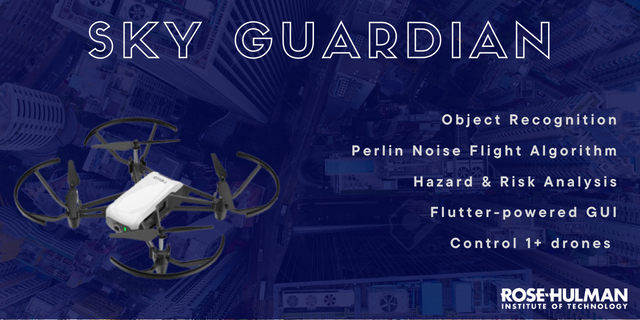
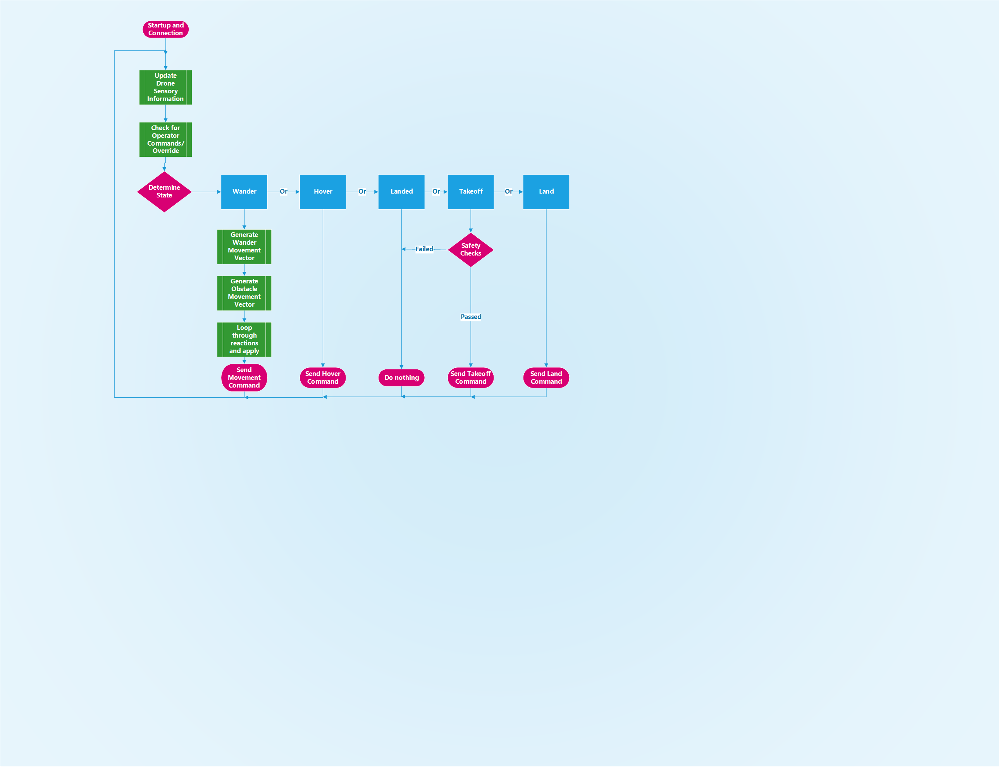
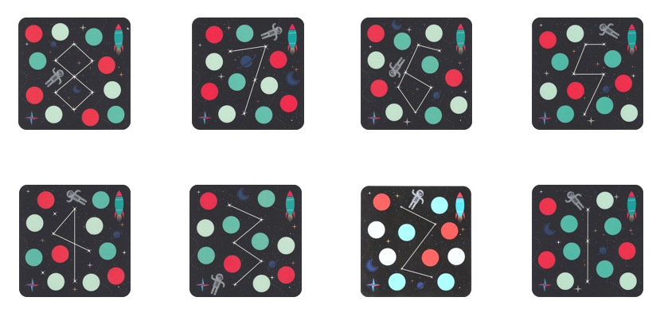
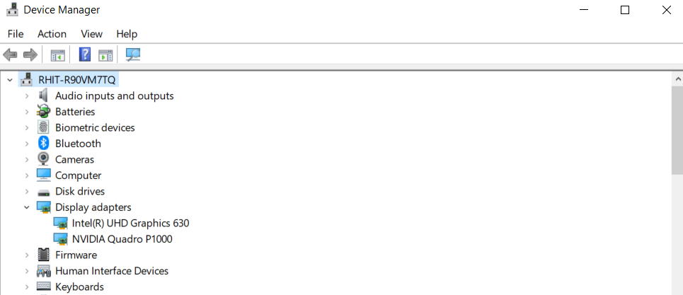
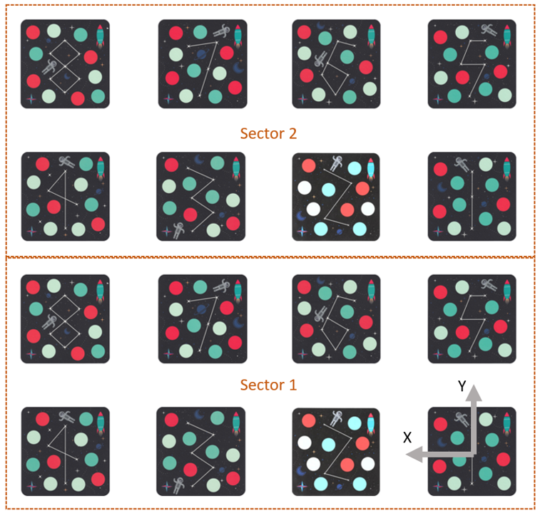

# inTellogence

inTellogence is an open-source codebase for people to learn drone control topics made by senior students at Rose-Hulman Institute of Technology located in Terre Haute, IN.

# Table of Contents

- [About](#about)
  - [Purpose](#purpose)
  - [Features](#features)
  - [System Components](#system-components)
- [Getting Started](#getting-started)
  - [Setting up drones and router](#setting-up-drones-and-router)
  - [How to run requirements](#how-to-run-requirements)
- [Examples](#examples)
  - [Implementing Reactive Behaviors](#creating-a-reactive-behavior-to-an-object)
- [Supplemental Documentation (UML, Performance Metrics, etc.)](#supplemental-documentation)
- [Troubleshooting resources](#troublehooting-resources)
- [References](#references)
- [Acknowledgements](#acknowledgements)

# About
## Purpose
We hope that students or people enthusiastic about learning about drones are able to gain new knowledge through this repository and possible contribute to it.

## Features
inTellogence has the following features:
- Ability to control 1 or 2 drones through a router
- Use of Mission Pads to confine the drone to a space
- Drone wander algorithm using a mix of pure random and smoothly changing trajectories via [Perlin Noise](https://www.khanacademy.org/computing/computer-programming/programming-natural-simulations/programming-noise/a/perlin-noise)
- Additional safety measures using industry hardware functional safety techniques
- Pre-trained Computer Vision models to recognize objects
- Ability to quickly implement reactive behaviors to objects and sensor readings
- [Flet](https://flet.dev)-powered language-agnostic GUI (Python, Go, C#)
- Easy-to-understand & User-tested documentation

## System Components

Graphic User Interface (GUI)

 
inTellogence uses <a href="https://flet.dev">Flet</a>, a simplified <a href="https://flutter.dev">Flutter</a> model, to build the GUI. Python is currently supported, but Go and C# are <a href="https://flet.dev/roadmap/">coming soon</a>.  

When first starting the program, the GUI brings you to a "landing" page where a user will be able to connect 1 or 2 drones.   
  

After verifying that the drone(s) are connected, the user can continue to a Main Dashboard that displays the OpenCV window output, various sensor readings, text input for chosen object identification, and buttons to Launch, Land, Hover an inidividual drone or both drones simultaneosly.   
  

 
There is also a window for the User to adjust various settings.  
  

The GUI uses the following components  

Multi-threading

 
We use threading to allow the GUI to access drone functions while the drone flight algorithm is running. This becomes a problem if the threads try to read/write the same piece of memory at the exact same time, but the chances of this happening are low for this project. 
---

 

OpenCV window for Flet

 
The code from <a href="https://www.youtube.com/watch?v=58aPh8rKKsk">Azu Technology</a> that creates a modern GUI for an OpenCV window was modified to display the OpenCV Tello video stream through the GUI. This repository is one of few, if not the only, that allows the Tello stremaing window to be viewed through Flet. 
---

Finite State Machine

 
General control of both drones is organized around a Finite State Machine (FSM). The primary state of wander is implemented alongside a few states that support smooth and safe operation. The general control logic is shown below. NOTE: ADD STATE TRANSITION CONDITIONS AT SOME POINT AND ADD LOST MISSION PAD AS WELL.  

 

Reactive Control Through Potential Fields

 
The primary path planning approach for Sky Guardian lies in reactive control LINK through potential fields LINK. In order to allow the drones to wander in a constrained space, Tello mission pads are utitilized in a pre-defined map. These mission pads allow the drone to localize and respond appropriately when moving out of intended airspace. BELOW: diagram of drone measuring it's location and drone being pushed into the space CURRENTLY PLACEHOLDER.  

  
Sky Guardian provides an outline for implementing various reactions to certain stimuli. For our purposes, reactions are individual responses to certain stimuli (ie, the drone detects a banana) and behaviors are sets of those reactions. We have defined two types of reactions: blocking and movement.  

A blocking reaction initiates a pre-defined set of instructions, during which the drone is incapable of performing any other movements. The trigger blocks the continuation of the control loop for a time.  

A movement reaction defines non-blocking instructions. So, it returns a movement force according to the same idea as potential fields. Hence, a drone could tend to fly toward certain objects or away from others.  

 

Object Recognition using Yolov8

 

Sky Guardian performs object recognition by implementing <a href="https://github.com/ultralytics/ultralytics"> Ultralytics Yolov8 </a>. All video feed analysis is abstracted out into the VideoAnalyzer class from video_analyzer.py. This wrapper class adds the ability to automatically download all Object Recognition models, as well as adjust the model size (speed/accuracy tradeoff) To explore the other models available using Yolov8 (pose, image segmentation, etc), consider editing video_analyzer.py. 

The output of the network can be slightly confusing (read about it <a href=""> here</a>.)
The CNN outputs several pieces of information about the objects detected. It's in the format of a Nx7 matrix, sorted in order of confidence. The indexes are shown below: <bv>

0: None
1: Class Label (default in reference)
2: Confidence Level
3: X bounding box coordinate
4: Y bounding box coordinate
5: bounding box width
6: bounding box height

The VideoAnalyzer automatically filters out detectiosn with a low confidence score, according to the default set in its global variables. //Addition: possibly add info about filtering if implemented  

CUDA: If we implement by the end of the year, it will also describe our approach to running inference through the GPU (installation requirements will be covered below)   

 

Functional Safety Engineering

 

<a href="https://www.61508.org/knowledge/what-is-a-functional-safety-system.php">Functional Safety Engineering</a> provides users exposure and a framework to implement various safety features that they deem necessary. Functional Safety involves developing safety-related systems for the Electronic/Electrical/Programmable Electronic components of a system. <a href="https://www.61508.org/knowledge/what-is-iec-61508.php">IEC61508</a>, <a href="https://webstore.iec.ch/publication/24241">IEC61511</a>, <a href="https://webstore.iec.ch/publication/59927">IEC62061</a>, and <a href="https://www.iso.org/standard/43464.html">ISO26262</a> are the standards of reference in Functional Safety Engineering.

Safety-Related Systems usually comprise of a sensor that provides information, a processor that provides logic to react to sensor readings, and an actuator or system component provides output based on this logic. These are the types of systems that are studied to identify potential risks and then deliver an appropriate solution that provides the appropriate level of risk reduction, protection, or mitigation.

In this project, our system is the Tello drone which relies on its camera, IMU, barometer, temperature sensor, and battery charge sensor to pull in information.  We have developed safety systems that attempt to mitigate risks when encountering stationary obstacles(like a wall) or moving obstacles(like a human). Some example safety features include: 

<li> Monitoring the battery temperature to check if it is overheating in flight and landing the drone if it does overheat. This helps preserve battery life.</li>
<li> Checking to see if the drone is oriented properly before takeoff to ensure that it does not launch into a trajectory that could cause it to hit something.</li>
<li> Using computer vision to detect objects, classify them, and take appropriate actions depending on the object classification. </li> 
<li> Using mission pads to localize and properly constrain the flight environment that the Tello drones use to navigate. </li> 

Functional Safety Engineering uses the <a href="https://www.iso.org/obp/ui/#iso:std:iso:26262:-9:ed-1:v1:en">V-model development process</a> from the <a href="https://www.iso.org/standard/43464.html">ISO26262</a> standard, which is shown below:

V-model Example

 
The left side of the V-model is conceptual development and product development. The bottom of the V-model is where the hardware and software designs are implemented. The right side of the V-model is where all testing activities of the design happen. 

---

Safety Features are designed during conceptual development in a process called the ‘<a href="https://arxiv.org/pdf/1704.06140.pdf">Hazard Analysis and Risk Assessment</a>’ or HARA. HARA uses an <a href="https://www.synopsys.com/automotive/what-is-asil.html">ASIL risk rating</a> chart to properly classify the specific HARA line item in question. Collisions in this project receive a SIL1 rating based off initial severity (S1), initial exposure (E3), and initial avoidability (C2). 

The HARA consists of the following steps:

Assumptions

 
Assumptions are created on how terminology is used and about the environment the product is in.
 
For this project, an example assumption is that the primary obstacles to be avoided will be stationary furniture and walls along with the users of the drones in the testing room.
---

 

Existing External Mitigating Measures

 
These are risk reducing factors that are already present in an environment. They exist independently of the systems.
 
For this project, to prevent the drone from hitting people, the only person(s) that can be present in the testing room are the drone operators. This mitigating measure is not in any drone control systems.
---

 

Operational Situations

 
These are the scenarios that the designers expect their product to be in regularly while it is operation/active/or in use. The designers will come up with ‘Considered Situational Attributes’ which are guide words that describe ‘motion’, ‘mode’, ‘obstacle exposure’, and ‘control’.
---

 

Guide words

 
In Functional Safety, guide words are created to produce operational scenarios. For this project some of our guide words were as follows: Mode = Launched, Motion = Forward, Control = Independent (not in swarm configuration), Obstacle Exposure = ‘Static’.An example operational scenario is ‘a single independent drone is launched and in a forward motion surveying a space with static objects.’
---

 

Hazard List

 
List of potential hazards and their type pulled from a list in the ISO12100 standard. Relevant Mechanical Hazards for the project include:
- Impact due to collision with stationary object
- Impact due to collision with moving object
---

 

Hazardous Operation

 
Hazerdous Operation combines Tasks and Functions along with suggested guidewords pulled from the SAEJ2980 standard to create potential resulting malfunctions. The resulting malfunctions constitute Hazardous Operation.
In this project, when the ‘Automated drone(s) is exploring’ an environment ‘as intended’, there is hazard exposure do to obstacles that are present in the environment. The resulting malfunction is an errant flight path if a collision occurs.
---

 

Hazardous Events

 
Hazerdous events combines Hazardous Operation and Operational Situation to describe the Hazardous Event that needs to be mitigated. 
In this project when the ‘Automated drone(s) is exploring’ an environment ‘as intended’, and there is hazard exposure do to obstacles that are present in the environment while ‘a single independent drone is launched and in a forward motion surveying a space with static objects’, the hazardous event is that the drone or operator is at risk of being hit by the drone should a malfunction occur because of the collision. 
---

 

Risk Reduction Measure

 
These are the safety features, which could either be design based or policy/procedural based, that are implemented to reduce the HARA line item to a lower risk rating per the ASIL risk rating chart.
For this project, we utilized computer vision and coded responses that react based on the type of object seen, as the basis for collision-based Risk Reduction Measures that lowered our SIL1 rating down to SIL0.
---

 

Once these safety features are implemented properly either through hardware or software measures, they are then testing as single units, in integration testing, and regression testing to ensure that everything works properly. From there, the project can be deployed with assurance that there are safety features present to actively mitigate risks.
---

 

Networking

 

 

# Getting Started
We used the following materials for this project:
- 2 Tello EDU drones
- Router (we used the <a href= "https://www.amazon.com/TP-Link-AC1750-Smart-WiFi-Router/dp/B079JD7F7G/ref=sr_1_3?keywords=WiFi%2BRouters%2Bfor%2BHome&qid=1663443788&sr=8-3&ufe=app_do%3Aamzn1.fos.006c50ae-5d4c-4777-9bc0-4513d670b6bc&th=1">TP-Link AC1750 Smart WiFi Router (Archer A7)</a>
- 16 Tello Mission Pads

## Setting up drones and router
This section will cover how to set up the router, connect your computer to it, and connect the drones to it.

## Installations before running for the first time

### Verify that your GPU is supported by CUDA
First, to verify that your system is GPU capable. Open your Device Manager and scroll to "Display Adapters." If your system has one, the GPU will be listed here. To ensure that your system is CUDA capable, make sure your GPU is one listed as supported here <a href="https://developer.nvidia.com/cuda-gpus">here</a>.

<em>Here, we can see our GPU is the Nvidia Quadro P1000</em>

### Download and install Cuda ()

This tutorial assumes you are using the environment manager <a href= "https://www.anaconda.com/">Anaconda</a>. See Supplemental documentation if you are unfamiliar with Anaconda, as it's an incredibly helpful tool for navigating python distributions.

### Package Installation
We provide two options to install required packages.

#### Anaconda Navigator
Using from the environments page in Anaconda Navigator, simply import the inTellogence_environment.yaml file.

#### With Anaconda Prompt
With your desired environment activated, and the inTellogence folder active, run the following command:

pip install -r requirements.txt

## Mission Pad Setup
For inTellogence to work as expected, it's important to setup the mission pads as the drone expects to see them, as mapping is currently not supported. This layout is shown below, where orientation, spacing and layout are important. Should you wish to adjust the spacing between the pads, these are defined as global constants in sensoryState.py, set by default to 50cm center to center. Since Tello EDU currently only supports 8 different mission pads, the flyable space is separated into two sectors, in which the drones track which quadrant they are in.

IMPORTANT: When taking off, place the drones facing the X direction and it Sector 1.

# Examples
## Creating a reactive behavior to an object
## Adding a new button to the GUI
## Adding a custom State

# Supplemental Documentation
# Troublehooting resources
+ [Tello Drone User Manual](https://dl-cdn.ryzerobotics.com/downloads/Tello/Tello%20User%20Manual%20v1.4.pdf)
+ [Official Flet developer community](https://discord.gg/mMJHgYEqRK)
+ [DJI Tello Online Community](https://tellopilots.com)
# References
# Acknowledgements 
We would like to our Capstone professors: Dr. Shradda Sangelkar and Dr. Jay McCormack, and external reviewers: Dr. Sriram Mohan, and Dr. Ryder Winck for their guidance, resources, and support throughout this project. We would also like to thank Dr. Sid Stamm, Dr. Amirmasoud Momenipour, Dr. Mark Hays, and Dr. Mellor for their subject-matter expertise. Lastly, we would like to thank you dear reader as our project only gains value if it is able to benefit someone else.