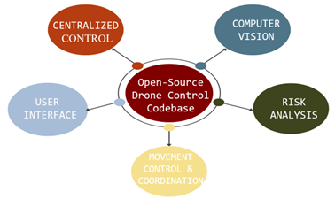
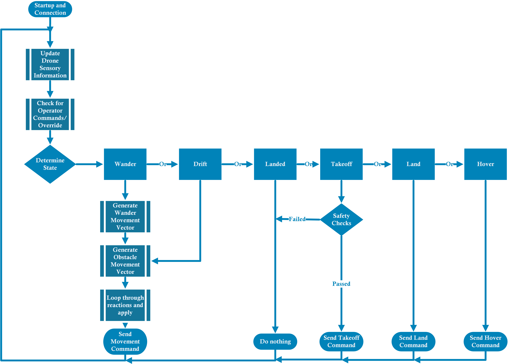

# inTellogence


# Table of Contents

- [inTellogence](#intellogence)
- [Table of Contents](#table-of-contents)
- [About](#about)
  - [Features](#features)
  - [System Components](#system-components)
- [Getting Started](#getting-started)
  - [Router and Drone Connection](#router-and-drone-connection)
  - [Necessary Installations](#necessary-installations)
    - [Verify that your GPU is supported by CUDA](#verify-that-your-gpu-is-supported-by-cuda)
    - [Download and install Cuda (11.8)](#download-and-install-cuda-118)
    - [Environment Setup](#environment-setup)
  - [Mission Pad Setup](#mission-pad-setup)
- [Examples](#examples)
- [Supplemental Documentation](#supplemental-documentation)
- [Troublehooting resources](#troublehooting-resources)
- [References](#references)
- [Acknowledgements](#acknowledgements)

# About
<p>Drones are quickly becoming utilized in the public sphere for entertainment, photography, surveillance, high-speed delivery, and remote healthcare. InTellogence is an open-source codebase made to supplement self-education for university students and hobbyists exploring drone control topics, using the low-cost DJI Tello Edu. It integrates multi-drone centralized control, computer vision, functional safety, and a custom Graphical User Interface (GUI). All code is written in Python, powered by popular packages such as OpenCV, Flet, and NVIDIA’s CUDA. InTellogence ultimately lowers the barrier of entry to drone robotics through detailed documentation and easily modified design. We hope that students or people enthusiastic about drones are able to gain new knowledge through this repository and possibly contribute to it.</p>

<div style="text-align: center;">
 
</div>

## Features
inTellogence has the following features:
- Ability to control 1 or 2 drones through a router
- Use of Tello Mission Pads to keep the drone within a constrained airspace
- Finite state machine that uses <a href = https://youtu.be/umkyPWDrys4>potential fields navigation</a>
- Additional safety measures using industry-relevant functional safety techniques
- Integration of <a href="https://github.com/ultralytics/ultralytics"> Ultralytics Yolov8</a> for object recognition
- Ability to quickly implement and layer reactive behaviors to objects and sensor readings
- [Flet](https://flet.dev)-powered GUI using Python
- Easy-to-understand documentation

## System Components

  <details><summary>Graphic User Interface (GUI)</summary><br>
    <p>inTellogence uses <a href="https://flet.dev">Flet</a>, a simplified <a href="https://flutter.dev">Flutter</a> model, to build the GUI. Python is currently supported, but Go and C# are <a href="https://flet.dev/roadmap/">coming soon</a>.
    </p> 

<p>There are two distinct GUI pages. First, the connection page allows you to input device information by running <i>connectivity_page.py.</i> This brings up a connection setup page, where the user can easily input device information for each drone.</p><br> 

<div style="text-align: center;">
  </div><br>

<p>After verifying that the drone(s) are connected, the user can continue to a Main Dashboard that displays the drone video feed, text input for chosen object identification, control buttons, and a reaction (detailed later) manager.</p> <br> 

<div style="text-align: center;">

</div><br>

<p>The GUI uses the following components</p><br>

<summary><b>Multi-threading</b></summary>
<br>
We use threading to allow the GUI to access drone functions while the drone flight algorithm is running. This becomes a problem if the threads try to read/write the same piece of memory at the exact same time, but the chances of this happening are low for this project.<br><br>

<summary><b>Drone video feed through Flet</b></summary>
<br>
The code from <a href="https://www.youtube.com/watch?v=58aPh8rKKsk">Azu Technology</a> that creates a modern GUI for an OpenCV window was modified to display the Tello video stream through the GUI. This repository is one of few, if not the only, that allows the Tello streaming window to be viewed through Flet.<br><br>
</details>

<details>
<summary>Finite State Machine</summary>
  <br><p>General control of both drones is organized around a Finite State Machine (FSM). The primary state of wander is implemented alongside a few states that support smooth and safe operation. The general control logic is shown below.</p><br>

<div style="text-align: center;">

</div>
</details> 

<details>
<summary>Reactive Control Through Potential Fields</summary><br>
  <p>The primary path planning approach for InTellogence lies in <a href = https://youtu.be/umkyPWDrys4>reactive control through potential fields</a>. In order to allow the drones to wander in a constrained space, Tello mission pads are utitilized in a pre-defined map. These mission pads allow the drone to localize and respond appropriately when moving out of intended airspace, applying a movement force proportional to it's measured distance outside of desired airspace. If you're interested in the linear algebra behind this, check out Coordinate Modelling in <a href=#supplemental-documentation>Supplemental Documentation</a></p>


<div style="text-align: center;"></div><br> 

InTellogence provides an outline for implementing various reactions to certain stimuli. For our purposes, reactions are individual responses to certain stimuli (ie, the drone detects a banana) and behaviors are sets of those reactions. We have defined two types of reactions: blocking and movement. <br>

A blocking reaction initiates a pre-defined set of instructions, during which the drone is incapable of performing any other movements. The stimuli trigger blocks the continuation of the control loop for a time. <br>

A movement reaction defines non-blocking instructions. So, it returns a movement vector according to the same idea as potential fields. Hence, a drone could tend to fly toward certain objects or away from others. <br>
</details> 

<details>
<summary>Object Recognition using Yolov8</summary>
<br>

InTellogence performs object recognition by implementing <a href="https://github.com/ultralytics/ultralytics"> Ultralytics Yolov8 </a>. All video feed analysis is abstracted out into the VideoAnalyzer class from <i>video_analyzer.py</i>. This wrapper class adds the ability to automatically download all object recognition models, as well as adjust the model size (speed/accuracy tradeoff), and acceptable confidence level. To explore the other models available using Yolov8 (pose, image segmentation, etc), consider editing <i>video_analyzer.py</i>.<br>

The output of the network can be slightly confusing (this article was helpful determining syntax <a href=""> here</a>.)
To access results in the form of an Nx6 matrix, use syntax along the lines of results[0].boxes.boxes The indexes are shown below: <br>

0: x1 bounding box coordinate<br>
1: y1 boudning box coordinate<br>
2: x2 bounding box coordinate<br>
3: y2 bounding box coordinate<br>
4: confidence score<br>
5: class label<br>

In order to speed up this detection process, this repository assumes the use of CUDA 11.8. This offloads the inference calculations to the GPU, where it can be parallelized. Installation instructions can be found in [Getting Started](#getting-started). Yolov8 allows for very minimal setup in this respect.<br>

</details> 

<details>
<summary>Functional Safety Engineering</summary>
<br>
<p><a href="https://www.61508.org/knowledge/what-is-a-functional-safety-system.php">Functional Safety Engineering</a> provides users exposure and a framework to implement various safety features that they deem necessary. Functional Safety involves developing safety-related systems for the Electronic/Electrical/Programmable Electronic components of a system. <a href="https://www.61508.org/knowledge/what-is-iec-61508.php">IEC61508</a>, <a href="https://webstore.iec.ch/publication/24241">IEC61511</a>, <a href="https://webstore.iec.ch/publication/59927">IEC62061</a>, and <a href="https://www.iso.org/standard/43464.html">ISO26262</a> are the standards of reference we use for Functional Safety Engineering.</p>

<p>Safety-Related systems usually comprise of a sensor that provides information, a processor that provides logic to react to sensor readings, and an actuator or system component that provides output based on this logic. These are the types of systems that are studied to identify potential risks and then deliver an appropriate solution that provides the appropriate level of risk reduction, protection, or mitigation.</p>

<p>In this project, our system is the Tello drone which relies on its camera, IMU (Inertial Measurement Unit), barometer, temperature sensor, and battery charge sensor to pull in information. Some example safety features include: </p>
<li> Monitoring the battery temperature to check if it is overheating in flight and landing the drone if it does overheat. This helps preserve battery life.</li>
<li> Checking to see if the drone is oriented properly before takeoff to ensure that it does not launch into a trajectory that could cause it to hit something.</li> 
<li> Using mission pads to localize and properly constrain the flight environment that the Tello drones use to navigate. </li> 
</p>

<p>Functional Safety Engineering uses the <a href="https://www.iso.org/obp/ui/#iso:std:iso:26262:-9:ed-1:v1:en">V-model development process</a> from the <a href="https://www.iso.org/standard/43464.html">ISO26262</a> standard, which is shown below. <br><br>

<div style="text-align: center;">

</div>

<em>The left side of the V-model is conceptual development and product development. The bottom of the V-model is where the hardware and software designs are implemented. The right side of the V-model is where all testing activities of the design happen. </em>


</p>
<p>Safety Features are designed during conceptual development in a process called the ‘<a href="https://arxiv.org/pdf/1704.06140.pdf">Hazard Analysis and Risk Assessment</a>’ or HARA. HARA uses an <a href="https://www.synopsys.com/automotive/what-is-asil.html">ASIL risk rating</a> chart to properly classify the specific HARA line item in question. Collisions in this project receive a SIL1 rating based off initial severity (S1), initial exposure (E3), and initial avoidability (C2). More information on the HARA can be found in the <a href=#supplemental-documentation>Supplemental Documentation</a></p>

Once these safety features are implemented properly either through hardware or software measures, they are then tested as single units with both integration and regression testing to ensure that everything works properly. From there, the project can be deployed with assurance that there are safety features present to actively mitigate risks.

</details> 

<details>
<summary>Networking</summary>

<p>The topic under discussion revolves around two distinct methodologies employed in swarm control, namely centralized and decentralized control. Decentralized control entails equipping each individual drone within the swarm with an exclusive "brain," enabling them to independently make decisions based on the limited information they receive from other members of the swarm.</p>

<p>On the other hand, centralized control involves the utilization of a single controller for computational purposes. This controller undertakes the necessary computations and subsequently dispatches commands to the individual actors within the swarm, directing their actions accordingly.</p>

<p>In the context of this particular project, a centralized control structure was adopted, where communication among the drones occurred over Wi-Fi, facilitated through a router. This is shown below.</p>

<div style="text-align: center;">
</div>
</details> 

# Getting Started
We used the following materials for this project:
- 2 Tello EDU drones
- Router (we used the <a href= "https://www.amazon.com/TP-Link-AC1750-Smart-WiFi-Router/dp/B079JD7F7G/ref=sr_1_3?keywords=WiFi%2BRouters%2Bfor%2BHome&qid=1663443788&sr=8-3&ufe=app_do%3Aamzn1.fos.006c50ae-5d4c-4777-9bc0-4513d670b6bc&th=1">TP-Link AC1750 Smart WiFi Router (Archer A7)</a>
- 16 Tello Mission Pads (a printable version is in Ref, but originally from <a href="https://tellopilots.com/threads/download-official-ryze-tello-edu-mission-pads.2756/">here</a>)

<p>NOTE: This repository was originally implemented on Windows, and does not support other operating systems.</p>

## Router and Drone Connection
This section will cover how to set up the router, connect your computer to it, and connect the drones to it.

1. Disconnect from the wifi you are connected to.
2. Turn on one of the drones by clicking on the side power button.
3. Connect to the wifi of the drone from your computer.
4. Locate the password to the router located on the bottom of the router. This should also include the specific router name.
5. Use the connectivity page to set the router information(<i>connectivity_page.py</i>)
6. Run <i>connect_to_router.py</i>
7.  Repeat steps 1-6 for the other drones you would like to link up with the router.
8.  Turn off all drones.
9.  Connect router to power source and turn on. 
10. Connect to the router (use the non 5G network if one is available).
11. Connect to the router. Type "tplinkwifi.net" and fill in the login information displayed.
12. Navigate to the DHCP section in the website.
13. Turn on one of the drones and a new IP address should appear in the DHCP section. Record the IP address shown in the DHCP section.
14. Repeat step 13 for all of the drones but ensure that only one drone is active at a time.
15. Now that all drones have a recorded IP address, use the connectivity page to save these values.

## Necessary Installations

### Verify that your GPU is supported by CUDA
First, verify that your system has a dedicated GPU. Open your Device Manager and scroll to "Display Adapters." If your system has one, the GPU will be listed here. To ensure that your system is CUDA capable, make sure your GPU is one listed as supported <a href="https://developer.nvidia.com/cuda-gpus">here</a>.<br><br>

<div style="text-align: center;">

</div>
<div style="text-align: center;">
<em>Here, we can see our GPU is the Nvidia Quadro P1000</em></div><br>


### Download and install Cuda (11.8)
Once you know your system is compatible, the version we used can be found <a href=https://developer.nvidia.com/cuda-toolkit-archive>here</a>. Make sure to use 11.8. Installation is as easy as downloading and installing with all defaults!


### Environment Setup

This tutorial assumes you are using the environment manager <a href= "https://www.anaconda.com/">Anaconda</a>. See <a href=#supplemental-documentation>Supplemental Documentation</a> if you are unfamiliar with Anaconda.It's an incredibly helpful tool for navigating python distributions.
<br></br>
There are multiple options to install required packages.
<br></br>

<details> <summary> Anaconda Navigator </summary>

Using from the environments page in Anaconda Navigator, simply import the inTellogence_environment.yaml file.
</details>

<details><summary>Anaconda Prompt</summary>

With your desired environment activated, and the inTellogence folder active, run the following command:

```conda env create -f drone.yaml```

</details>

<details><summary>Without Anaconda</summary>
A requirements file is included for convenience. Install through the following command in your virtual environment:

```pip install -r requirements.txt```

</details>

<br>

## Mission Pad Setup
For inTellogence to work as expected, it's important to setup the mission pads as the drone expects to see them, as mapping is currently not supported. This layout is shown below, where orientation, spacing and layout are important. Should you wish to adjust the spacing between the pads, these are easily changed in <i>repo.properties</i>. Since Tello EDU currently only supports 8 different mission pads, the flyable space is separated into two sectors marked off below. The drones track which sector they are in.

IMPORTANT: When taking off, place the drones facing the X direction and anywhere in Sector 1.

<div style="text-align: center;">
</div>
<br>

# Examples
<details><summary> Create a new behavior/reaction</summary>
<br>
There are two different types of reactions: movement and blocking. Let's create a new movement reaction, which will return a force vector to the drone. Open <i>reaction.py</i>.
<br></br>
These reactions have access to all the sensory information from the drone via the input argument.
<br></br>
First extend the movementReaction class:

```python
class moveBackIfPerson(movementReaction):
```

Now lets add an identifier so the GUI can read it:

```python
identifier = "Move back if person"`
```

Define the reaction:

```python
def react(self,input: SensoryState, currentMovement: np.array):
  res = np.zeros((4,1)) #base column array to return the force vector
  if input.visibleObjects is not None: # don't iterate through something not there!
    for object in input.visibleObjects:
      if(int(object[5]) == int(vision_class.person)):
        res[1] = 5 # move the drone back

  return res
  #Note that additional information about the structure of "visible Objects" can be found above in "Object Recognition using Yolov8"

```
Almost there! Now open <i>behavior.py</i>.

Create a new behavior (set of reactions)

```python
class myNewBehavior(behaviorFramework):
  # lets not add any blocking reactions
  blockingReactions = [] 
  # Lets add a previously made reaction with our new one!
  movementReactions = [rxt.followCellPhone(),rxt.moveBackIfPerson()]
```

This behavior is what you will pass in when you create your drone object!
</details>

<details><summary> Add a custom State </summary>
Adding a new state is simple!

In <i>drone_states.py</i>, just add the name of your new state, we'll call ours "Dance", with an arbitary, unique number:

```python
class State(Enum):
    Grounded = 1
    Takeoff = 2
    Land = 3
    Wander = 4
    #new state
    Dance = 5
```

Now, in <i>drone.py</i>, find the operate function. In it is a match-case block that changes the drone's actions based on the state. Let's add a new case:

```python
  case State.Land:
    ...
  case State.Dance:
    self.dance(): 
    if (conditional):
      self.opState = State.NextState #pseudocode
```
Here, dance() could be whatever you want. Just make sure the function isn't blocking (contains no infinite loops)!
</details>

# Supplemental Documentation

[Coordinate Modelling](Ref/Coordinate_Modelling.pdf)

<details><summary>Hazard Analysis and Risk Assessment</summary>

The HARA consists of the following steps:
<details><summary><b>Assumptions</b></summary>

<br>
Assumptions are created on how terminology is used and about the environment the product is in.
<br> <br>
<p>For this project, an example assumption is that the primary obstacles to be avoided will be stationary furniture and walls along with the users of the drones in the testing room.
<br>
</details> 

<details><summary><b>Existing External Mitigating Measures</b></summary>

<br>
These are risk reducing factors that are already present in an environment. They exist independently of the systems.
<br>
For this project, to prevent the drone from hitting people, the only person(s) that can be present in the testing room are the drone operators. This mitigating measure is not in any drone control systems.<br><br>
</details> 

<details><summary><b>Operational Situations</b></summary>

<br>
These are the scenarios that the designers expect their product to be in regularly while it is operating, active, or in use. The designers will come up with ‘Considered Situational Attributes’ which are guide words that describe ‘motion’, ‘mode’, ‘obstacle exposure’, and ‘control’.
</details> 

<details><summary><b>Guide words</b></summary>

<br>
In Functional Safety, guide words are created to produce operational scenarios. For this project some of our guide words were as follows: Mode = Launched, Motion = Forward, Control = Independent (not in swarm configuration), Obstacle Exposure = ‘Static’. An example operational scenario is ‘a single independent drone is launched and in a forward motion surveying a space with static objects.’
</details> 

<details>
<summary><b>Hazard List</b></summary>

<br>
List of potential hazards and their type pulled from a list in the <a href=https://www.cencenelec.eu/media/CEN-CENELEC/Areas%20of%20Work/CENELEC%20sectors/Mechanical%20and%20Machines/Documents/Quicklinks/eniso12100relationmachinerydirective.pdf>ISO12100</a> standard. Relevant Mechanical Hazards for the project include:
<li> Impact due to collision with stationary object</li>
<li> Impact due to collision with moving object</li>
</details> 

<details>
<summary><b>Hazardous Operation</b></summary>
<br>
Hazardous Operation combines Tasks and Functions along with suggested guidewords pulled from the <a href=https://www.nhtsa.gov/sites/nhtsa.gov/files/documents/13498a_812_573_alcsystemreport.pdf>SAEJ2980</a> standard to create potential resulting malfunctions. The resulting malfunctions constitute Hazardous Operation.
In this project, when the ‘Automated drone(s) is exploring’ an environment ‘as intended’, there is hazard exposure do to obstacles that are present in the environment. The resulting malfunction is an errant flight path if a collision occurs.<br>
</details> 

<details>
<summary><b>Hazardous Events</b></summary>

<br>
Hazardous events combines Hazardous Operation and Operational Situation to describe the Hazardous Event that needs to be mitigated. 
In this project when the ‘Automated drone(s) is exploring’ an environment ‘as intended’, and there is hazard exposure due to obstacles that are present in the environment while ‘a single independent drone is launched and in a forward motion surveying a space with static objects’, the hazardous event is that the drone or operator is at risk of being hit by the drone should a malfunction occur because of the collision. 
</details> 

<details><summary><b>Risk Reduction Measure</b></summary>

<br>
These are the safety features, which could either be design based or policy/procedural based, that are implemented to reduce the HARA line item to a lower risk rating per the ASIL risk rating chart.
For this project, we utilized the Tello Mission Pads to constrain the drone to an airspace, and built a netted cage for redundancy, as the basis for collision-based Risk Reduction Measures that lowered our SIL1 rating down to SIL0.
</details> 
</details>

# Troublehooting resources
+ [Tello Drone User Manual](https://dl-cdn.ryzerobotics.com/downloads/Tello/Tello%20User%20Manual%20v1.4.pdf)
+ [Official Flet developer community](https://discord.gg/mMJHgYEqRK)
+ [DJI Tello Online Community](https://tellopilots.com)
# References

<p>Strother, C. (2023). Codes and Ethics Advisement to Sky Guardian Team. Internal RHIT report: unpublished.</p>

<p>Berry, C. A. (2012). Mobile robotics for multidisciplinary study. Synthesis Lectures on Control and Mechatronics, 3(1), 1-95.</p>

<p>Winck, Ryder. "Coordinate Transformations” Class lecture, Robot Dynamics and Control, Rose-Hulman Institute of Technology, Terre Haute, IN, December, 2022.</p>

<p>"Hazard Analysis and Risk Assessment beyond ISO 26262: Management of Complexity via Restructuring of Risk-Generating Process," in Safety of the Intended Functionality , SAE, 2020, pp.69-78.</p>

<p>World Leaders in Research-Based User Experience. “10 Usability Heuristics for User Interface Design.” Nielsen Norman Group, https://www.nngroup.com/articles/ten-usability-heuristics/#poster.</p>

<p>An Introduction to Functional Safety and IEC 61508 - MTL INST, www.mtl-inst.com/images/uploads/datasheets/App_Notes/AN9025.pdf.</p>

# Acknowledgements 
We would like to thank our external reviewers: Dr. Sriram Mohan, and Dr. Ryder Winck for their guidance, resources, and support throughout this project. We would also like to thank Dr. Sid Stamm, Dr. Amirmasoud Momenipour, Dr. Mark Hays, and Dr. Mellor for their subject-matter expertise. Lastly, we would like to thank you dear reader as our project only gains value if it is able to benefit someone else.